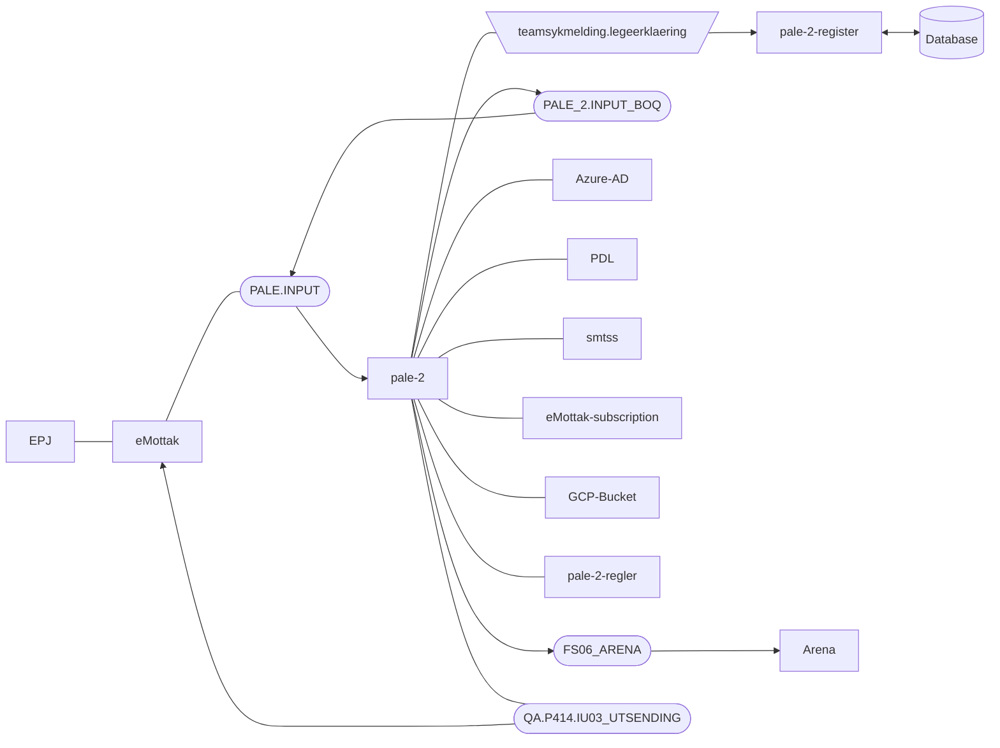

[](https://github.com/navikt/pale-2/actions/workflows/deploy.yml)

# Prosessering av legeerklæringer (PALE)
Application that receives Legeerklæringer from external systems, doing some validation, 
then pushing it to our internal systems.

## FlowChart
This the high level flow of the application


## Technologies used
* Kotlin
* Ktor
* Gradle
* Junit
* Postgres

#### Requirements

* JDK 17


#### Build and run tests
To build locally and run the integration tests you can simply run
``` bash
./gradlew shadowJar
```
or on windows 
`gradlew.bat shadowJar`

#### Creating a docker image
Creating a docker image should be as simple as
``` bash 
docker build -t pale-2 .
```

#### Running a docker image
``` bash 
docker run --rm -it -p 8080:8080 pale-2
```

### Upgrading the gradle wrapper
Find the newest version of gradle here: https://gradle.org/releases/ Then run this command:

``` bash 
./gradlew wrapper --gradle-version $gradleVersjon
```

### Guide to EPJ
https://www.ehelse.no/Standardisering/standarder/legeerklaering-ved-arbeidsuforhet/_/attachment/inline/a0258ee2-d216-4698-8820-b8dea0585395:bb93e3d95d8a9bf59166f40ff870406036c49f64/Legeerkl%C3%A6ring%20ved%20arbeidsuf%C3%B8rhet%20(HIS%20808052008).pdf

### Contact

This project is maintained by [navikt/teamsykmelding](CODEOWNERS)

Questions and/or feature requests? Please create an [issue](https://github.com/navikt/pale-2/issues)

If you work in [@navikt](https://github.com/navikt) you can reach us at the Slack
channel [#team-sykmelding](https://nav-it.slack.com/archives/CMA3XV997)
