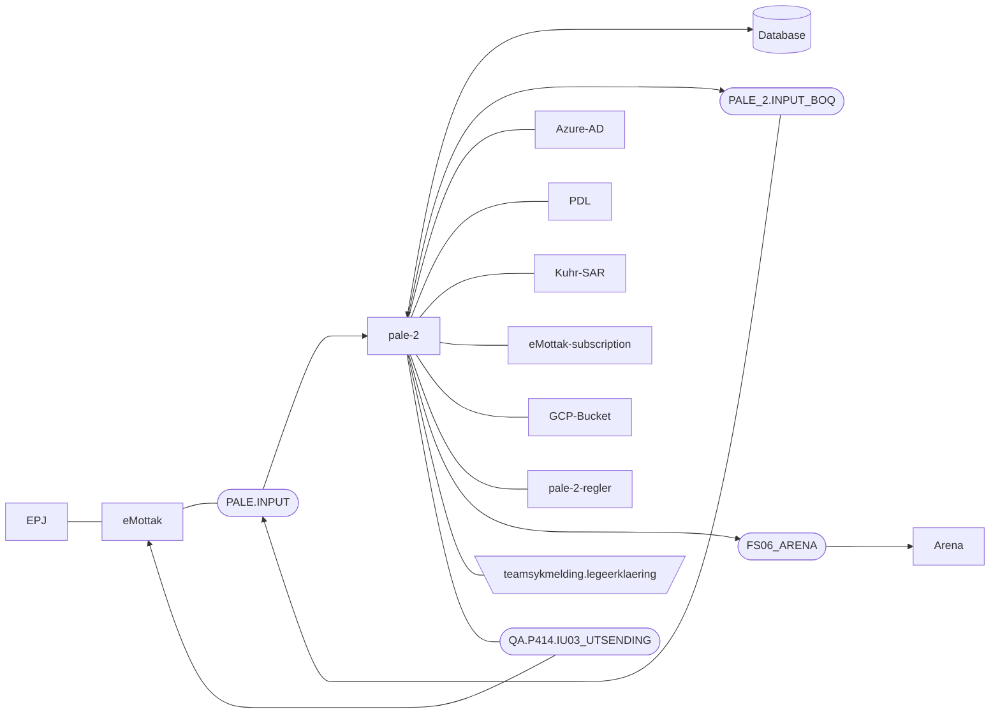

[](https://github.com/navikt/pale-2/workflows/Deploy%20to%20dev%20and%20prod/badge.svg)

# Prosessering av legeerklæringer (PALE)
Application that receives Legeerklæringer from external systems, doing some validation, 
then pushing it to our internal systems.


## FlowChart
This the high level flow of the application


## Technologies used
* Kotlin
* Ktor
* Gradle
* Junit
* Postgres

#### Requirements

* JDK 17

### Getting github-package-registry packages NAV-IT
Some packages used in this repo is uploaded to the GitHub Package Registry which requires authentication. 
It can, for example, be solved like this in Gradle:
```
val githubUser: String by project
val githubPassword: String by project
repositories {
    maven {
        credentials {
            username = githubUser
            password = githubPassword
        }
        setUrl("https://maven.pkg.github.com/navikt/pale-2-common)
    }
}
```

`githubUser` and `githubPassword` can be put into a separate file `~/.gradle/gradle.properties` 
with the following content:

```                                                     
githubUser=x-access-token
githubPassword=[token]
```

Replace `[token]` with a personal access token with scope `read:packages`.
See githubs guide [creating-a-personal-access-token](https://docs.github.com/en/authentication/keeping-your-account-and-data-secure/creating-a-personal-access-token) on
how to create a personal access token.

Alternatively, the variables can be configured via environment variables:

* `ORG_GRADLE_PROJECT_githubUser`
* `ORG_GRADLE_PROJECT_githubPassword`

or the command line:

```
./gradlew -PgithubUser=x-access-token -PgithubPassword=[token]
```

#### Build and run tests
To build locally and run the integration tests you can simply run `./gradlew shadowJar` or on windows 
`gradlew.bat shadowJar`

#### Creating a docker image
Creating a docker image should be as simple as `docker build -t pale-2 .`

#### Running a docker image
`docker run --rm -it -p 8080:8080 pale-2`


### Upgrading the gradle wrapper
Find the newest version of gradle here: https://gradle.org/releases/ Then run this command:

```./gradlew wrapper --gradle-version $gradleVersjon```

### Guide to EPJ
https://www.ehelse.no/Standardisering/standarder/legeerklaering-ved-arbeidsuforhet/_/attachment/inline/a0258ee2-d216-4698-8820-b8dea0585395:bb93e3d95d8a9bf59166f40ff870406036c49f64/Legeerkl%C3%A6ring%20ved%20arbeidsuf%C3%B8rhet%20(HIS%20808052008).pdf

### Contact

This project is maintained by navikt/teamsykmelding

Questions and/or feature requests? Please create an [issue](https://github.com/navikt/pale-2/issues)

If you work in [@navikt](https://github.com/navikt) you can reach us at the Slack
channel [#team-sykmelding](https://nav-it.slack.com/archives/CMA3XV997).
