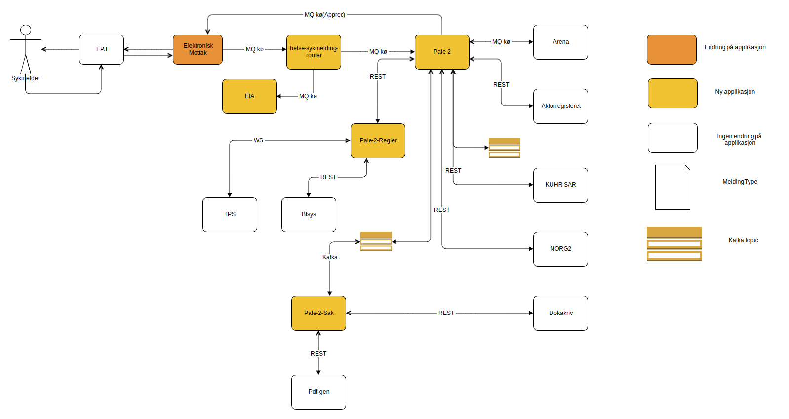

[](https://github.com/navikt/pale-2/workflows/Deploy%20to%20dev%20and%20prod/badge.svg)

# Prosessering av legeerklæringer (PALE)
Repository for PALE (legeerklæringer). Application written in Kotlin used to receive legeerklæringer from external systems, doing some validation, then pushing it to our internal systems.




## Technologies used
* Kotlin
* Ktor
* Gradle
* JDK 12
* Spek
* Jackson

#### Requirements

* JDK 12

### Getting github-package-registry packages NAV-IT
Some packages used in this repo is uploaded to the Github Package Registry which requires authentication. It can, for example, be solved like this in Gradle:
```
val githubUser: String by project
val githubPassword: String by project
repositories {
    maven {
        credentials {
            username = githubUser
            password = githubPassword
        }
        setUrl("https://maven.pkg.github.com/navikt/pale-2-common)
    }
}
```

`githubUser` and `githubPassword` can be put into a separate file `~/.gradle/gradle.properties` with the following content:

```                                                     
githubUser=x-access-token
githubPassword=[token]
```

Replace `[token]` with a personal access token with scope `read:packages`.

Alternatively, the variables can be configured via environment variables:

* `ORG_GRADLE_PROJECT_githubUser`
* `ORG_GRADLE_PROJECT_githubPassword`

or the command line:

```
./gradlew -PgithubUser=x-access-token -PgithubPassword=[token]
```

#### Build and run tests
To build locally and run the integration tests you can simply run `./gradlew shadowJar` or on windows 
`gradlew.bat shadowJar`

#### Creating a docker image
Creating a docker image should be as simple as `docker build -t pale-2 .`

#### Running a docker image
`docker run --rm -it -p 8080:8080 pale-2`


## Testing the whole flow for handling manual legeerklæring in preprod
### Submitting legeerklæring:
1. Navigate to syfomock: https://syfomock.dev-sbs.nais.io/opprett_legeerklearing
2. Note the number below Msgid (this changes with each submission)
3. Fill in the content you want in the Legeerklæring
4. Submit the Legeerklæring

### Verification in the legeerklæring applications:
1. Log in at https://logs.adeo.no and use the following search string: x_msgId: $ yourMsgId, ex: x_msgId: 58e1d88d-36fa-4756-a06a-32c384ba885f
2. Verify that what you expect to happen with a legeerklæring actually happens. It should then be Ok | Manual processing | rejected
   What you look for are items: status = OK, status = MANUAL_PROCESSING or status = INVALID
   
### Verification in Gosys:
1. Login User (Case managers / supervisors):
   Z992389
2. Check that the legeerklæring is placed in gosys:
   - Log in at https://gosys-nais-q1.nais.preprod.local/gosys
   - Search for user with fnr
3. Verify that there is a legeerklæring task under tasks overview and 
   that this is the legeerklæring you submitted

### Verification in Gosys:

1. Open this link(NAV-internal sites): http://confluence.adeo.no/download/attachments/98337004/NAV%20Skrivebord%20Stack_Q1b.ica?version=1&modificationDate=1432891072000&api=v2
2. Inside navskrivebord q1, open internett explorer and write the following adress: http://arena-q1.adeo.no/forms/frmservlet?config=areq01
3. Logg on with your arena id, ask eks Bente Gåserud if you dont have a arena user.
4. Search then the patient with based on the fnr
5. Choose then helserelaterte hendelser and see that the legeerklæring is there.

### Importing flowchart from gliffy confluence
1. Open a web browser and go the confluence site that has the gliffy diagram you want to import, example site:
https://confluence.adeo.no/display/KES/SyfoSmMottak.
2. Click on the gliffy diagram and the "Edit Digram" buttom
3. Then go to File -> Export... and choose the Gliffy File Format (The gliffy diagram, should now be downloaded to you computer)
4. Open a web browser and go to: https://app.diagrams.net/
5. Choose the "Open Existing Diagram", then choose the file that was downloaded from step 3.
6. Click on File -> Save (The diagram is now saved as a drawio format, store it in the source code)
7. Click on File -> Export as SVG...(The diagram is now saved as SVG, store it in the source code)
8. Commit and push the changes so its up to date

### Editing existing flowchart
1. Open a web browser and go to: https://app.diagrams.net/
2. Choose the "Open Existing Diagram", then choose the file /src/flowchart/flyttdiagram.drawio
3. Do the changes you want, and the save it as a drawio, back to /src/flowchart/flyttdiagram.drawio
4. Click on File -> Export as SVG... save the file to here: file here: /src/svg/flytdiagram.svg
5. Commit and push the changes so its up to date

### Creating a new flowchart
1. Open a web browser and go to: https://app.diagrams.net/
2. Choose the "Create New diagram",
3. Do the changes you want, and the save it as a drawio, back to /src/flowchart/flyttdiagram.drawio
4. Click on File -> Export as SVG... save the file to here: file here: /src/svg/flytdiagram.svg
5. Commit and push the changes so its up to date

